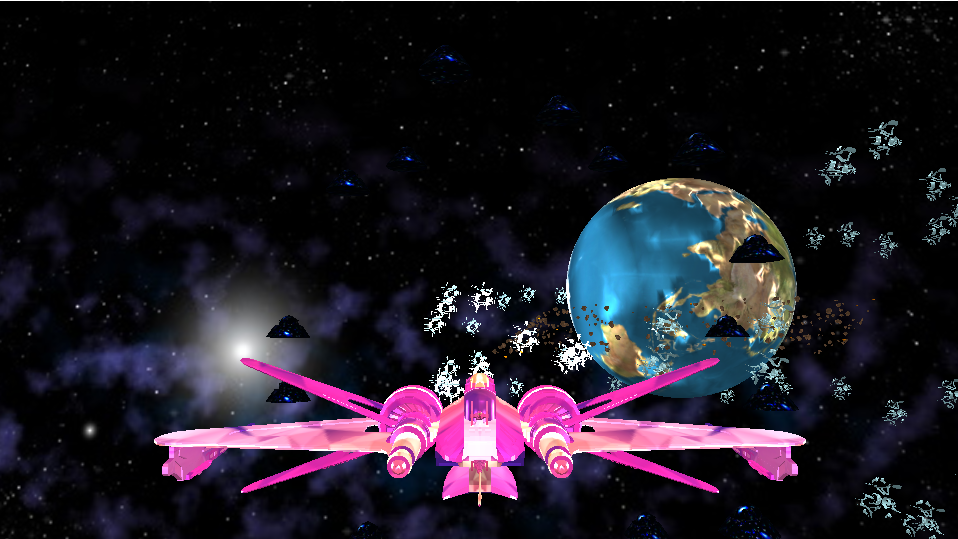

# 太空猎捕

> 在3202年，天文学家发现了一颗周围有陨石的行星，那里有一些珍贵的黄金。作为一名杰出的宇航飞行员，你正在驾驶一艘战机获得这些黄金。然而，当地人的几辆太空车正在四处走动并保护他们的黄金（你只有几次机会挣脱他们的抓捕），你需要避开他们、收集金牌并顺利返回身后的飞碟母舰。




## 准备

- ###### [开始](.\exe\Form.exe) （如果不进行项目开发，可直接双击exe体验）

- ###### 开发工具

  - Visual Studio（OpenGL）

- ###### 安装

  1. 创建项目，添加code文件中.h、.cpp

  2. VS中打开项目属性配置

  3. 链接器 $\rightarrow$ 常规 $\rightarrow$ 附加库目录 
  
     ```
     .\Dependencies\glm
     .\Dependencies\glew
     .\Dependencies\GLFW
     .\Dependencies\stb_image
     ```

  4. 链接器 $\rightarrow$ 输入 $\rightarrow$ 附加依赖项
  
     ```
     opengl32.lib
     glfw3.lib
     glew32.lib
     ```


## 操作

| 操作       | 效果                                    |
| ---------- | --------------------------------------- |
| KEY：ESC   | 退出游戏                                |
| KEY：ENTER | 继续游戏（当被太空车抓捕时）            |
| 鼠标移动   | 控制战机方向                            |
| 鼠标右键   | 切换游戏人称                            |
| 鼠标滚轮   | 更改鼠标灵敏度                          |
| KEY：W     | 前进                                    |
| KEY：S     | 后退                                    |
| KEY：A     | 左移                                    |
| KEY：D     | 右移                                    |
| KEY：Q     | 雷达（机身下显现太空抓捕车）            |
| KEY：E     | 照明（根据太空抓捕车反射斑躲避抓捕）    |
| KEY：+     | 加强照明光强                            |
| KEY：-     | 减弱照明光强                            |
| KEY：SHIFT | 加速                                    |
| KEY：Z     | 减速                                    |
| KEY：F7    | 减弱画面光强                            |
| KEY：F10   | 修改光标模式（NORMAL、HIDDEN、DISABLE） |
| KEY：F11   | 切换全屏                                |
| KEY：SPACE | 重置黄金收集                            |

> 代码说明的详细介绍:point_right: [SUMMARY](./SUMMARY.md) :point_left:


## 贡献

您所做的任何commit都**非常感谢!!!**

如果您有建议可以使其更好，请 fork仓库并创建一个pull request。您也可以简单地使用issue

别忘了给项目打一颗==star:star:==！再次感谢！

1. Fork the Project
2. Create your Feature Branch (`git checkout -b feature/AmazingFeature`)
3. Commit your Changes (`git commit -m 'Add some AmazingFeature'`)
4. Push to the Branch (`git push origin feature/AmazingFeature`)
5. Open a Pull Request


## Contact

Github：[biglonglong](https://github.com/biglonglong)

Email：<1522262926@qq.com>

