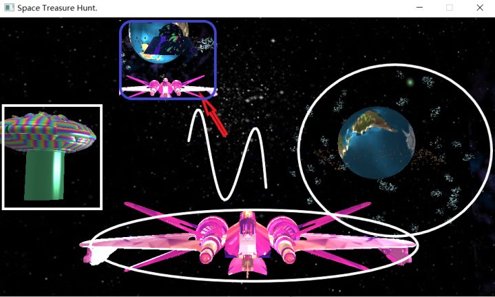
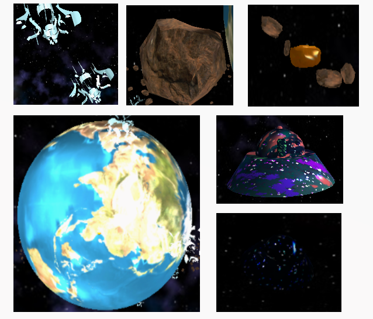

# 效果

### 整体



### 模型




# 技术

## 概况

> | NUM  | 内容                                     |
> | ---- | ---------------------------------------- |
> | 1    | 渲染一颗行星、一个航天器和至少三个航天器 |
> | 2    | 行星和本地空间飞行器的自转               |
> | 3    | 渲染天空框                               |
> | 4    | 基本灯光渲染                             |
> | 5    | 渲染小行星环形云                         |
> | 6    | 岩石的旋转                               |
> | 7    | 正确的观点                               |
> | 8    | 使用鼠标控制航天器的自转                 |
> | 9    | 使用键盘控制航天器的平移                 |
> | 10   | 收集金牌                                 |
> | 11   | 警告后更改本地车辆的纹理                 |
> | 12   | 完成整个收集后更改航天器的纹理           |
> | 13   | 添加另一个光源                           |
> | 14   | 行星的法线贴图                           |
> | 15   | 更多种类obj                              |
> | 16   | …                                        |

- 模型、VAO、VBO、EBO：spacecraft, planet, rock, satellite, craft, aircarrier
- 着色器：ourNormalShader, ourLightShader, ourSkyboxShader, ourSampleShader, ourNormalMapShader
- 纹理：skyboxTexture、spacecraftTexture, planetTexture, planetNormal, rockTexture, goldTexture, satelliteTexture, craftTexture, redTexture, aircarrierTexture
- 深度测试、模板测试、混合、面剔除
- 对象参数
  - 星球系统：system_position、rotation_direction、rotation_speed、rotation_radius、rotation_offset、rockmount、goldmount、satellitemount
  - 太空车：craftmount、movement_length、movement_circle、movement_cycle
  - 战机：invincible_time
  - 机制：golden_mount、relive_mount、aircarrierPositions
- 对象函数
  - 计时器 `bool Clocker(double starttime, double cycle)`
  - 距离检查 `int DistanceCheck(glm::vec3 originpos, glm::mat4 model, float threshold1, float threshold2)`
  - 机制逻辑 `void ArrestLogic()   void SucessLogic()`
- monitor 监视 window
  - `monitor = glfwGetPrimaryMonitor();`


## 实现

### 岩石 RandMatrics

> 采用带有RandMatrics的实例化着色器（减少GPU-CPU通信）；利用两次model矩阵实现公转

```C++
gl_Position = projection * view * model* aInstanceMatrix[gl_InstanceID] * vec4(aPos, 1.0);
```

```C++
glm::mat4 modelsample = glm::translate(glm::mat4(1.0f),glm::vec3(sin(glm::radians(float(i))) * rotation_radius + displacement,displacement,cos(glm::radians(float(i)))*rotation_radius + displacement));

modelsample = glm::rotate(modelsample, glm::radians(static_cast<float>((rand() % 360))), glm::vec3(0.4f, 0.6f, 0.8f));
```

```C++
model = glm::translate(glm::mat4(1.0f), system_position);
model = glm::rotate(model, glm::radians(rotation_speed *float(glfwGetTime())), rotation_direction);	
```

```C++
glDrawElementsInstanced(GL_TRIANGLES, static_cast<unsigned int>(rock.indices.size()), GL_UNSIGNED_INT, 0, rockmount);
```


### 黄金 RandMatrics

> 利用一次model矩阵实现公转；黄金采集中止渲染

```C++
glm::mat4 modelsample = glm::translate(glm::mat4(1.0f), system_position + glm::vec3(displacement));

modelsample = glm::rotate(modelsample, glm::radians(rotation_speed * static_cast<float>(glfwGetTime())), rotation_direction);

modelsample = glm::translate(modelsample,glm::vec3(sin(float(i)) * rotation_radius + displacement, displacement, cos(float(i)) * rotation_radius + displacement));
```

```c++
if (goldGeted[goldnum]) continue;
```


### 卫星 轴向

> 两个相关向量决定星球与卫星法向

```C++
model = glm::rotate(model, glm::radians(rotation_speed * 30 * static_cast<float>(glfwGetTime())), system_position - glm::vec3(model[3][0], model[3][1], model[3][2]));
```


### 飞碟 回收

> 关于距离 战机回收机制

```C++
float distance = DistanceCheck(camera.Position, model, 10.0, 8.0);
if (distance == -1 && goldgetednum>=golden_mount) {
	view_angle += glm::vec3(0.0f,0.01f,0.0f);
	counter++;
if (counter >= 100) {
	SucessLogic();
} 
```


### 太空车 参数方程

> 一个关于时间的参数方程

```C++
model = glm::translate(glm::mat4(1.0f), glm::vec3(movement_circle * cos(movement_cycle*5*glfwGetTime()+craftnum), movement_circle * sin(movement_cycle*5*glfwGetTime()+craftnum),-movement_length+movement_length *sin(movement_cycle*(glfwGetTime()+craftnum))));	
```

#### “雷达”

> 无意之间发现的，可能是混合与模板测试共同造成的结果

```C++
glEnable(GL_BLEND);
glBlendFunc(GL_SRC_ALPHA, GL_ONE_MINUS_SRC_ALPHA);

glStencilFunc(GL_ALWAYS, 1, 0xFF);
glStencilMask(0xFF);
...
glStencilFunc(GL_NOTEQUAL, 1, 0xFF);
glStencilMask(0x00);
glDisable(GL_DEPTH_TEST);
```


### 天空盒 skybox

> 普普通通的天空盒罢了，没什么特别的，记得关闭深度测试

```C++
glDepthFunc(GL_LEQUAL);
ourSkyboxShader.use();
glBindVertexArray(VAO[0]);
glActiveTexture(GL_TEXTURE0);
glBindTexture(GL_TEXTURE_CUBE_MAP, skyboxTexture);
glDrawArrays(GL_TRIANGLES, 0, 36);
glDepthFunc(GL_LESS);
```


### 战机 view

> 两个纹理变换机制；一个视角固定方法；四个移动效果(速度函数)

```C++
if (Clocker(invincible_starttime, invincible_time)) {
	craftTexture.bind(0);
}
if (goldgetednum>=golden_mount) {
	goldTexture.bind(0);
}
```

```C++
view = glm::mat4(1.0f);
ourLightShader.setMat4("view", view);

```

```C++
if (left_rotation_flag) {
	model = glm::rotate(model, glm::radians(direction_rotation_angle), glm::vec3(0.0f, 0.0f, -1.0f));
}	
```


### 星球 Normal

> 采用带法向贴图的着色器进行光照渲染；一个自转机制

```C++
planetTexture.bind(0);
planetTexture.bind(1);
planetNormal.bind(2);
...
model = glm::rotate(model, glm::radians(rotation_speed * static_cast<float>(glfwGetTime())), rotation_direction);
```


### 光源

> 着色器利用环境光照、漫反射光照和镜面光照原理对纹理进行光照效果叠加

代码详见[VertexShader](./exe/VertexShaderCodeLight.glsl)、[FragmentShader](./exe/FragmentShaderCodeLight.glsl)


### 距离检查

> 利用model矩阵的原理计算对象坐标

```C++
int DistanceCheck(...) {
	float distance = sqrt(pow(originpos.x - model[3][0], 2) + pow(originpos.y - model[3][1], 2) + pow(originpos.z - model[3][2], 2));
	if (distance >= threshold1) return 0;
	else if (distance >= threshold2) return 1;
	else if (distance < threshold2) return -1;
	...
}
```


### 逮捕逻辑

> relive_mount控制游戏是否结束；continue_flag+while+glfwPollEvents交互战机被逮捕后是否继续（ENTER）；invincible_starttime 利用计时器控制无敌时间

```C++
void ArrestLogic() {
	if (relive_mount == 0) {
		...
		glfwDestroyWindow(window);
	}

	continue_flag = 0;
	while (!continue_flag) {
		glfwPollEvents();
	};
	invincible_starttime = glfwGetTime();
}
```


